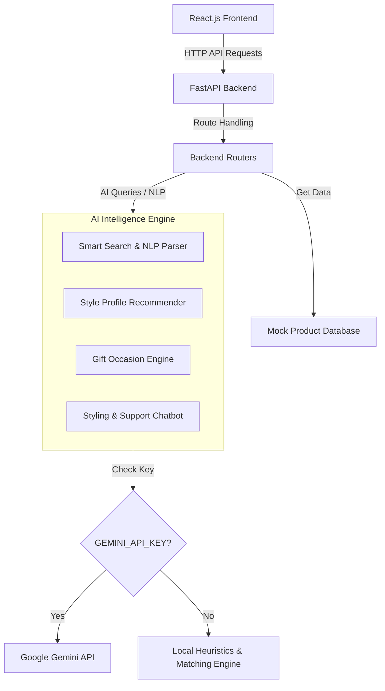

<<<<<<< HEAD
# AuraGems AI: AI-Powered Jewellery E-commerce Platform

AuraGems AI is a premium, high-end jewellery e-commerce platform that integratesmaster-crafted aesthetics with advanced Artificial Intelligence services to provide a highly personalized, luxury shopping experience. 

The project features a **FastAPI (Python) backend** powering NLP search, style coordination, gift matching, and conversational assistance, paired with a responsive **React.js (Vite) frontend** showcasing rich styling, fluid micro-animations, glassmorphism, and a dark luxury aesthetic.

---

## 🌟 AI Features Implemented

AuraGems AI incorporates **four** major AI-powered capabilities to enhance customer engagement and solve real e-commerce challenges:

1. **Smart NLP Product Search**: 
   - **How it works**: Users query the store using everyday language (e.g., *"gold ruby pendants under $2000"*). The backend parses the query, extracts parameters (materials, gemstone types, categories, budgets), and runs a similarity-scoring matcher.
   - **Value Add**: Returns scored products alongside a detailed **AI Match Analysis** explanation, showing customers exactly why the product fits their query.

2. **Style Profile Matchmaker**:
   - **How it works**: An interactive 5-step quiz analyzing skin undertone (warm, cool, neutral), statement preference (minimalist, classic, bold), lifestyle (daily-wear vs. evening-wear), gemstone preferences, and total budget.
   - **Value Add**: Curates a complete coordinate jewellery wardrobe (Ring + Necklace + Bracelet/Earrings) matching their answers, backed by a detailed **AI Styling Rationale** explaining why the metals and gems fit their tone.

3. **AI Gift Planner & Note Generator**:
   - **How it works**: A stepper matching budget tiers and relationships (Mother, Partner, Friend) with specific occasions (Anniversary, Birthdays, Graduation).
   - **Value Add**: Filters matching gift items and dynamically drafts a context-specific, heartfelt **Greeting Card Message** that the user can copy.

4. **AuraGems AI Styling & Support Chatbot**:
   - **How it works**: A conversational support assistant. If a `GEMINI_API_KEY` is provided, it uses the official Gemini API; otherwise, it falls back to a custom local intent classifier.
   - **Value Add**: Resolves complex customer sizing charts, return policies, jewellery care instructions, and recommends product links in markdown format.

---

## 🛠️ Technology Stack & Architecture

- **Frontend**: React.js, Vite, Vanilla CSS, Lucide React (Icons), LocalStorage (Cart persistence).
- **Backend**: Python 3.13+, FastAPI (REST API), Uvicorn (ASGI Web Server), Pydantic (Data validation), Python Dotenv.
- **AI Integrations**: Google Gemini API (Conversational styling & support) with full client/server local rule-based NLP fallbacks.



---

## 🚀 Setup & Execution Guide

### Prerequisite
Ensure you have **Python 3.10+** and **Node.js 18+** installed.

---

### Step 1: Run the Backend Service (FastAPI)

1. Open a terminal and navigate to the `backend` folder:
   ```bash
   cd backend
   ```
2. Create and activate a Python virtual environment:
   - **Windows (PowerShell)**:
     ```powershell
     python -m venv venv
     .\venv\Scripts\Activate.ps1
     ```
   - **Mac/Linux**:
     ```bash
     python3 -m venv venv
     source venv/bin/activate
     ```
3. Install dependencies:
   ```bash
   pip install -r requirements.txt
   ```
4. *(Optional)* Add your Gemini API key:
   Create a `.env` file inside the `backend` folder and add:
   ```text
   GEMINI_API_KEY=your_gemini_api_key_here
   ```
   *Note: If no API key is provided, the platform automatically activates a local heuristics fallback engine, making all features fully functional out-of-the-box.*
5. Run the local development server:
   ```bash
   python main.py
   ```
   The backend API will run on **`http://localhost:8000`**. You can visit **`http://localhost:8000/docs`** for interactive Swagger documentation.

---

### Step 2: Run the Frontend Application (React)

1. Open a new terminal window and navigate to the `frontend` folder:
   ```bash
   cd frontend
   ```
2. Install npm packages:
   ```bash
   npm install
   ```
3. Launch the Vite development server:
   ```bash
   npm run dev
   ```
4. Open the local address printed (typically **`http://localhost:5173`**) in your web browser.

---

## 📂 Project Structure

```text
jewellery-ecommerce/
├── backend/
│   ├── main.py            # FastAPI endpoints and server initialization
│   ├── products.py        # Mock database with 12 handcrafted luxury items
│   ├── ai_engine.py       # Core AI modules (search, recommender, chatbot)
│   ├── requirements.txt   # Python dependency list
│   └── verify_backend.py  # Local CLI test script for backend verification
│
├── frontend/
│   ├── public/assets/     # AI-generated luxury banner & product images
│   ├── src/
│   │   ├── components/    # Reusable UI elements (Navbar, Footer, ProductCard)
│   │   ├── context/       # State contexts (CartContext.jsx)
│   │   ├── pages/         # Page layouts (Home, Listing, Details, AI Hub, About, Contact)
│   │   ├── api.js         # API integration layer with client-side AI fallback
│   │   ├── index.css      # Core HSL color variables and styling guidelines
│   │   ├── main.jsx       # App bootstrap and Context providers wrapping
│   │   └── App.jsx        # Routing coordinator and Shopping bag drawer
│   │
│   ├── package.json       # Frontend project packages
│   └── vite.config.js     # Vite bundler parameters
│
└── README.md              # Project documentation
```
=======
# AuraGems-AI-
AuraGems AI - AI-Powered Jewellery E-commerce Platform
>>>>>>> ae895bdf34ffcc2ad8eea75d2ec0f9274aae3e42
